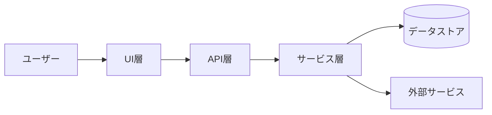
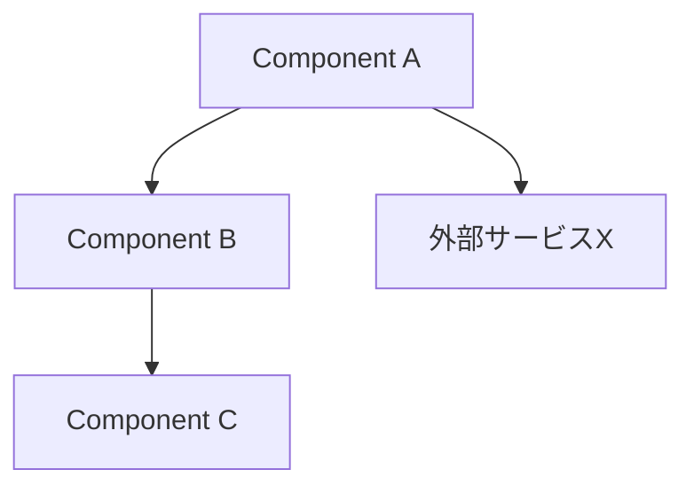
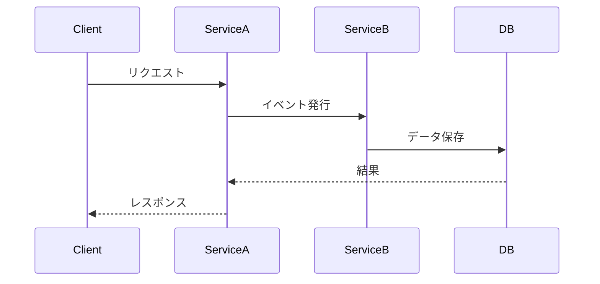
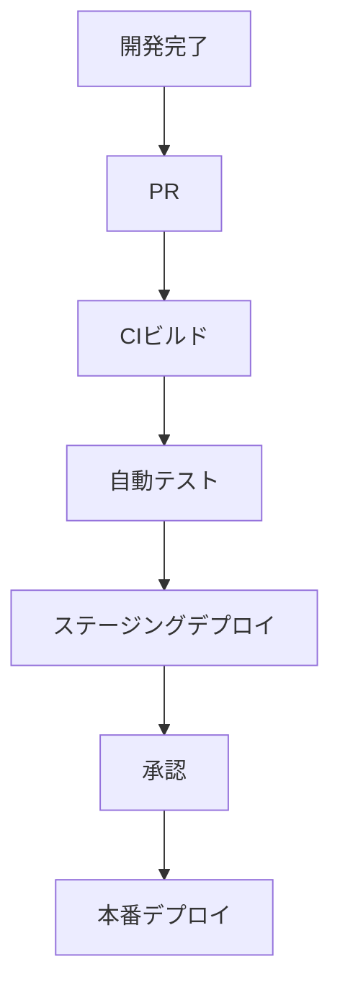

# アーキテクチャドキュメント テンプレート

**文書バージョン**: v1.0  
**作成日**: [作成日]  
**最終更新**: [更新日]  
**作成者**: [作成者名]

> **文書の位置付け**  
> - 本ドキュメントはシステム全体の構造・設計原則・技術選定理由など「なぜこの形になっているか」を示します。  
> - 内部仕様書（機能別詳細、運用手順、改善計画など）は「何を実装し、どのように運用するか」の具体的な仕様・作業寄りの内容を扱います。  
> - ADR（Architecture Decision Record）は個別の意思決定履歴を残すものであり、Architecture.md は採択済みの決定を統合して「現時点の全体像」を提示する役割です。  
> - 仕様変更時は、まず内部仕様書を更新し、アーキテクチャに影響が出る場合はADRを発行・更新し、その結果を反映する形で本ドキュメントを改訂してください。詳細な手順は `adr_guideline.md` を参照。

---

## 📋 目次

1. [概要](#1-概要)
2. [要求整理](#2-要求整理)
3. [全体アーキテクチャ](#3-全体アーキテクチャ)
4. [コンポーネント詳細](#4-コンポーネント詳細)
5. [データ・イベントフロー](#5-データイベントフロー)
6. [インフラストラクチャ](#6-インフラストラクチャ)
7. [セキュリティとコンプライアンス](#7-セキュリティとコンプライアンス)
8. [品質属性対応](#8-品質属性対応)
9. [アーキテクチャ決定記録](#9-アーキテクチャ決定記録)
10. [テスト・検証戦略](#10-テスト検証戦略)
11. [デプロイ・運用設計](#11-デプロイ運用設計)
12. [今後の改善計画](#12-今後の改善計画)
13. [付録](#13-付録)

---

## 1. 概要

### 1.1 背景と目的
- [プロジェクトの背景]
- [アーキテクチャ文書の目的]

### 1.2 ステークホルダー

| 役割 | 名前/部署 | 関心事 |
|------|-----------|--------|
| [プロダクトオーナー] | [氏名] | [期待と懸念] |
| [アーキテクト] | [氏名] | [期待と懸念] |

### 1.3 スコープ
- **対象システム**: [対象範囲]
- **非対象**: [範囲外要素]

---

## 2. 要求整理

### 2.1 ビジネス要求
- [要求1]
- [要求2]

### 2.2 システム要求

| 種別 | 内容 | 優先度 | 備考 |
|------|------|--------|------|
| 機能 | [機能要求1] | [High/Medium/Low] | [備考] |
| 非機能 | [非機能要求1] | [High] | [備考] |

### 2.3 制約条件
- **技術制約**: [例: 既存クラウドサービス利用必須]
- **組織制約**: [例: チーム構成、スキルセット]
- **コスト制約**: [予算、ライセンス]

---

## 3. 全体アーキテクチャ

### 3.1 システムコンテキスト

### 3.2 アーキテクチャスタイル
- [例: マイクロサービス / クリーンアーキテクチャ / レイヤード]
- **採用理由**: [メリット]
- **トレードオフ**: [デメリットと対策]

### 3.3 技術スタック

| 層 | 技術 | バージョン | 備考 |
|----|------|------------|------|
| プレゼンテーション | [例: React] | [バージョン] | [補足] |
| アプリケーション | [例: NestJS] | [バージョン] | [補足] |
| データ | [例: PostgreSQL] | [バージョン] | [補足] |
| インフラ | [例: AWS EKS] | [バージョン] | [補足] |

---

## 4. コンポーネント詳細

### 4.1 コンポーネント一覧

| コンポーネント | 役割 | 主な責務 | インターフェース | 依存先 |
|----------------|------|----------|------------------|--------|
| [Component A] | [役割] | [責務] | [REST/イベント/DBなど] | [依存先] |

### 4.2 コンポーネント図

### 4.3 コンポーネント別詳細

#### 4.3.x [コンポーネント名]
- **説明**: [概要]
- **主要機能**: [機能1, 機能2]
- **データ入出力**: [入力/出力モデル]
- **失敗時の挙動**: [フォールバック]

---

## 5. データ・イベントフロー

### 5.1 データモデルサマリ
- [主要エンティティと関係]

### 5.2 データフロー

### 5.3 イベント/メッセージ設計
- **イベント名**: [例: UserCreated]
- **ペイロード**: [主要フィールド]
- **配信方法**: [Pub/Sub、キュー]

---

## 6. インフラストラクチャ

### 6.1 環境構成

| 環境 | 用途 | 主なリソース | 備考 |
|------|------|--------------|------|
| development | [用途] | [例: Docker Compose] | [備考] |
| staging | [用途] | [例: AWS ECS] | [備考] |
| production | [用途] | [例: AWS ECS] | [備考] |

### 6.2 ネットワーク構成
- **VPC/サブネット**: [構成、CIDR]
- **セキュリティグループ/Firewall**: [ルール]

### 6.3 可用性・スケーラビリティ
- **冗長化**: [AZ/リージョン構成]
- **スケーリング**: [オートスケールポリシー]

---

## 7. セキュリティとコンプライアンス

### 7.1 認証・認可
- [方式、プロバイダ]

### 7.2 データ保護
- **暗号化**: [静的/動的]
- **キー管理**: [KMSなど]

### 7.3 脅威モデルと対策
- **主要脅威**: [例: SQL Injection]
- **対策**: [バリデーション、WAF]

### 7.4 コンプライアンス
- [準拠規格やポリシー]

---

## 8. 品質属性対応

| 品質属性 | 要求 | 対応策 | 検証方法 |
|----------|------|--------|----------|
| 可用性 | [例: 99.9%] | [冗長化構成] | [障害試験] |
| 性能 | [例: 200ms以内] | [キャッシュ] | [負荷試験] |
| セキュリティ | [要件] | [対策] | [ペネトレーションテスト] |
| 拡張性 | [要件] | [モジュール設計] | [レビュー] |

---

## 9. アーキテクチャ決定記録

| ID | 日付 | 決定事項 | 選定理由 | 影響範囲 | ステータス |
|----|------|----------|----------|----------|------------|
| ADR-001 | [日付] | [決定概要] | [理由] | [影響] | [Accepted] |

各決定については `docs/adr/` などに詳細を保存すること。

---

## 10. テスト・検証戦略

### 10.1 テストレベル
- **単体テスト**: [対象、指標]
- **統合テスト**: [内容、依存関係]
- **E2Eテスト**: [シナリオ]
- **非機能テスト**: [負荷、セキュリティ]

### 10.2 品質ゲート
- **CI/CD連携**: [必須チェック]
- **レビュー体制**: [コードレビュー、アーキレビュー]

---

## 11. デプロイ・運用設計

### 11.1 デプロイフロー

### 11.2 デプロイ戦略
- [ローリング/ブルーグリーン/カナリア]
- [ロールバック手順]

### 11.3 運用監視
- **監視項目**: [CPU、エラーレートなど]
- **アラート閾値**: [設定値と通知先]

### 11.4 インシデント対応
- **エスカレーションフロー**: [手順]
- **連絡体制**: [担当者、連絡先]

---

## 12. 今後の改善計画

### 12.1 技術的負債
- [負債1と解消計画]

### 12.2 ロードマップ
- **短期（3ヶ月以内）**: [項目]
- **中期（6ヶ月以内）**: [項目]
- **長期（1年以内）**: [項目]

---

## 13. 付録

### A. 用語集

| 用語 | 説明 |
|------|------|
| [用語1] | [説明] |

### B. 参照資料
- [資料名](URL)

### C. 改訂履歴

| バージョン | 日付 | 変更内容 | 作成者 |
|-----------|------|---------|--------|
| v1.0 | [日付] | [初版作成] | [作成者] |

---

## 📤 ファイル分割ガイド

- 本テンプレートが肥大化した場合は「コンポーネント詳細」「インフラ」「品質属性」などテーマ別に分割し、`architecture_part-01.md` のように連番を付けて保存してください。
- 分割後は索引用の `architecture_index.md` を作成し、各パートの目的と関連を明示してください。
- バージョン管理のため、旧版は `archive/architecture/` 配下に移動し、変更点を `CHANGELOG_architecture.md` に記録してください。
