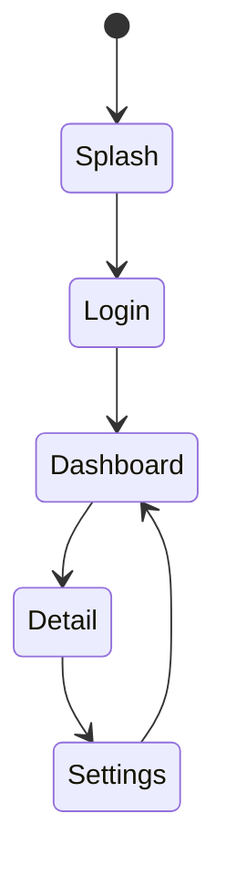
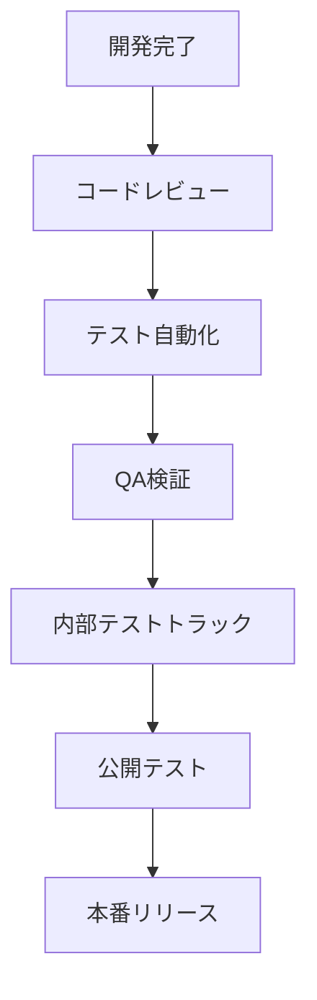

# [プロジェクト名] Androidアプリ内部仕様書

**文書バージョン**: v1.0  
**作成日**: [作成日]  
**最終更新**: [更新日]  
**作成者**: [作成者名]

---

## 📋 目次

1. [アプリ概要](#1-アプリ概要)
2. [UIフローとデザイン](#2-uiフローとデザイン)
3. [アプリケーションアーキテクチャ](#3-アプリケーションアーキテクチャ)
4. [データ連携と同期](#4-データ連携と同期)
5. [オフライン・データ保持](#5-オフラインデータ保持)
6. [認証・セキュリティ](#6-認証セキュリティ)
7. [パフォーマンス最適化](#7-パフォーマンス最適化)
8. [ログ・モニタリング](#8-ログモニタリング)
9. [テスト戦略](#9-テスト戦略)
10. [ビルド・リリース管理](#10-ビルドリリース管理)
11. [運用・サポート](#11-運用サポート)
12. [今後の改善計画](#12-今後の改善計画)

---

## 1. アプリ概要

### 1.1 プロジェクト目的
[プロジェクトの目的・背景を記載]

### 1.2 ターゲット利用シナリオ
- [ユースケース1]
- [ユースケース2]

### 1.3 対応デバイス・OS

| 区分 | 最小OS | 推奨OS | 画面サイズ | 備考 |
|------|--------|--------|------------|------|
| スマートフォン | Android [バージョン] | Android [バージョン] | [例: 4.7"～6.7"] | [備考] |
| タブレット | Android [バージョン] | Android [バージョン] | [例: 7"～12"] | [備考] |

### 1.4 技術スタック

| 分類 | 技術 | バージョン | 用途 |
|------|------|-----------|------|
| **言語** | [Kotlin/Java] | [バージョン] | [用途説明] |
| **UI** | [Jetpack Compose/XML] | [バージョン] | [用途説明] |
| **DI** | [Hilt/Koinなど] | [バージョン] | [用途説明] |
| **非同期処理** | [Coroutines/RxJavaなど] | [バージョン] | [用途説明] |
| **ネットワーク** | [Retrofit/Ktorなど] | [バージョン] | [用途説明] |
| **データベース** | [Room/DataStoreなど] | [バージョン] | [用途説明] |

---

## 2. UIフローとデザイン

### 2.1 画面遷移図

### 2.2 画面一覧

| 画面ID | 画面名 | 概要 | 主なコンポーネント | 備考 |
|--------|--------|------|--------------------|------|
| [SCREEN-01] | [画面名] | [説明] | [Composeコンポーネント/Fragment] | [備考] |

### 2.3 デザイン仕様
- **テーマ/カラー**: [Material Theme設定]
- **タイポグラフィ**: [フォント/サイズ]
- **アイコン/イラスト**: [使用するアセットと管理方法]
- **ライブラリ**: [デザインシステムライブラリやFigmaリンク]

### 2.4 多端末対応
- **レイアウトブレークポイント**: [デバイスごとのUI調整方針]
- **ダークモード**: [サポート状況と切替方法]
- **アクセシビリティ**: [TalkBack対応、フォントスケーリング方針]

---

## 3. アプリケーションアーキテクチャ

### 3.1 モジュール構成

| モジュール | 役割 | 依存関係 | 備考 |
|------------|------|----------|------|
| `app` | エントリポイント | [依存先] | [備考] |
| `core` | 共通ロジック | [依存先] | [備考] |
| `feature-[name]` | 個別機能 | [依存先] | [備考] |

### 3.2 アーキテクチャパターン
- **採用パターン**: [MVVM/MVI/Clean Architectureなど]
- **レイヤー**:
  - **Presentation**: [ViewModel, UI層]
  - **Domain**: [UseCase, Interactor]
  - **Data**: [Repository, DataSource]

### 3.3 依存性注入
- [DIフレームワーク構成]
- [モジュール別の提供定義]
- [テスト時の差し替え方針]

### 3.4 ナビゲーション
- [Jetpack Navigation/独自ルーターなどの設定]
- [Deep Link対応方針]

---

## 4. データ連携と同期

### 4.1 API連携
- **HTTPクライアント**: [設定内容]
- **共通ヘッダー**: [認証/言語など]

### 4.2 エンドポイント一覧

| 機能 | メソッド | エンドポイント | DTO | キャッシュ |
|------|----------|---------------|-----|------------|
| [例: ユーザー情報取得] | GET | `/api/v1/users/me` | `UserResponse` | [短期キャッシュ] |

### 4.3 同期戦略
- **ポーリング/Push通知**: [同期方法]
- **データ整合性**: [コンフリクト解決ルール]

### 4.4 バックエンド変更時の影響範囲
- [バージョン管理ポリシー]
- [互換性テスト手順]

---

## 5. オフライン・データ保持

### 5.1 永続化方針
- **ローカルデータソース**: [Room/DataStoreなどの利用]
- **暗号化**: [暗号化ストレージの要否]

### 5.2 データ構造

| エンティティ | スキーマ | 更新頻度 | 備考 |
|--------------|---------|----------|------|
| [例: UserEntity] | [フィールド一覧] | [同期頻度] | [備考] |

### 5.3 オフライン動作
- **サポート機能**: [オフライン時の動作]
- **再同期フロー**: [オンライン復帰時の処理]

---

## 6. 認証・セキュリティ

### 6.1 認証フロー
- [外部プロバイダ/自前認証のフロー]
- [トークン取得/更新タイミング]

### 6.2 トークン管理
- **保存場所**: [EncryptedSharedPreferencesなど]
- **有効期限**: [更新条件]
- **ログアウト処理**: [手順]

### 6.3 アプリ内セキュリティ
- **ルート検知**: [必要有無と対応]
- **スクリーンショット制御**: [必要性]
- **機密情報遮断**: [ログ出力制限]

---

## 7. パフォーマンス最適化

### 7.1 指標
- **アプリ起動時間**: [目標値]
- **スクロール性能**: [fps/スムーズさ]
- **バッテリー消費**: [測定方法]

### 7.2 最適化戦略
- **リスト最適化**: [LazyColumn/RecyclerView設定]
- **イメージロード**: [Coil/Glide設定とキャッシュ]
- **バックグラウンド処理**: [WorkManager/Coroutine設定]

### 7.3 メモリ管理
- [LeakCanary導入方針]
- [メモリ制約下のテスト]

---

## 8. ログ・モニタリング

### 8.1 ログ方針
- **ログレベル**: [VERBOSE/DEBUG/INFO/WARN/ERRORの使い分け]
- **PII対策**: [個人情報を含めないルール]

### 8.2 クラッシュレポート
- [Firebase Crashlytics/Sentryなどの設定]
- [アラート条件と通知先]

### 8.3 ユーザー行動トラッキング
- **イベント設計**: [イベント名規則、パラメータ]
- **分析ツール**: [Firebase Analytics/Mixpanelなど]

---

## 9. テスト戦略

### 9.1 テストレベル
- **ユニットテスト**: [対象層、使用フレームワーク(JUnit/MockK)]
- **UIテスト**: [Espresso/Compose Testの方針]
- **統合テスト**: [Kaspressoなど]

### 9.2 デバイステスト
- **実機テスト**: [対象デバイス、OS組み合わせ]
- **クラウドテスト**: [Firebase Test Labなどの活用]

### 9.3 CI/CD連携
- [自動テスト実行フロー]
- [失敗時のエスカレーション手順]

---

## 10. ビルド・リリース管理

### 10.1 ビルド構成

| ビルドタイプ | アプリID | サイン証明書 | Proguard | 備考 |
|--------------|---------|--------------|----------|------|
| debug | [ID] | [キーストア情報] | [有/無] | [備考] |
| release | [ID] | [キーストア情報] | [有/無] | [備考] |

### 10.2 リリースフロー

### 10.3 リリース管理
- **バージョニング**: [Semantic Versioningなど]
- **ストア申請**: [必要書類、審査期間の目安]
- **ロールアウト戦略**: [段階的リリース、%配布]

### 10.4 設定・秘密情報
- **Gradle Properties**: [管理ルール]
- **Firebase/外部SDKキー**: [自動注入方法]

---

## 11. 運用・サポート

> 日常運用手順や監視アラート対応の共通事項は `TEMPLATE_OPERATION.md` をベースにした運用ドキュメントを参照し、本セクションではAndroidアプリ固有の運用観点（ストア運用、リリーストラック、端末サポートなど）を記載してください。

### 11.1 障害対応
- **検知方法**: [モニタリングツール]
- **連絡体制**: [担当者、連絡手段]

### 11.2 サポート問い合わせ
- **チャネル**: [メール/アプリ内フォーム]
- **SLA**: [初動/解決目標]

### 11.3 依存アップデート
- **Google Playサービス更新**: [確認頻度]
- **SDK/ライブラリ**: [アップデートポリシー]

---

## 12. 今後の改善計画

### 12.1 短期改善項目（3ヶ月以内）
- [ ] [改善項目1]
- [ ] [改善項目2]

### 12.2 中期改善項目（6ヶ月以内）
- [ ] [改善項目1]
- [ ] [改善項目2]

### 12.3 長期改善項目（1年以内）
- [ ] [改善項目1]
- [ ] [改善項目2]

### 12.4 技術的負債
- [技術的負債1の説明と対応計画]
- [技術的負債2の説明と対応計画]

---

## 付録

### A. 用語集

| 用語 | 説明 |
|------|------|
| [用語1] | [説明] |
| [用語2] | [説明] |

### B. 参考資料

- [参考資料1のタイトル](URL)
- [参考資料2のタイトル](URL)

### C. 変更履歴

| バージョン | 日付 | 変更内容 | 作成者 |
|-----------|------|---------|--------|
| v1.0 | [日付] | [初版作成] | [作成者] |

---

### 📋 チェックリスト

- [ ] プロジェクト固有情報の記入完了
- [ ] 対応デバイス/OS要件の記入完了
- [ ] UIフロー・アプリ構成の記入完了
- [ ] データ連携・オフライン戦略の記入完了
- [ ] ビルド/リリース手順の記入完了
- [ ] 運用セクションに `TEMPLATE_OPERATION.md` への参照とAndroid固有事項を記載
- [ ] 影響のあるADRを `docs/adr/` に作成または更新済み
- [ ] `template/architecture.md` の更新が必要か確認し反映済み

---

## 📤 ファイル分割ガイド

- 本テンプレートが肥大化した場合は「UI」「アーキテクチャ」「リリース管理」などテーマ単位でファイルを分割し、`TEMPLATE_INTERNAL_SPECIFICATION_ANDROID_APP_part-01.md` のように通し番号を付けてください。
- 分割後は各ファイルに本ガイドを残し、最新の構成を `README` または索引用ファイルにまとめてください。
- 大型バージョンアップ時は旧版を `archive/` ディレクトリに移動し、差分を明記したチェンジログを作成してください。
