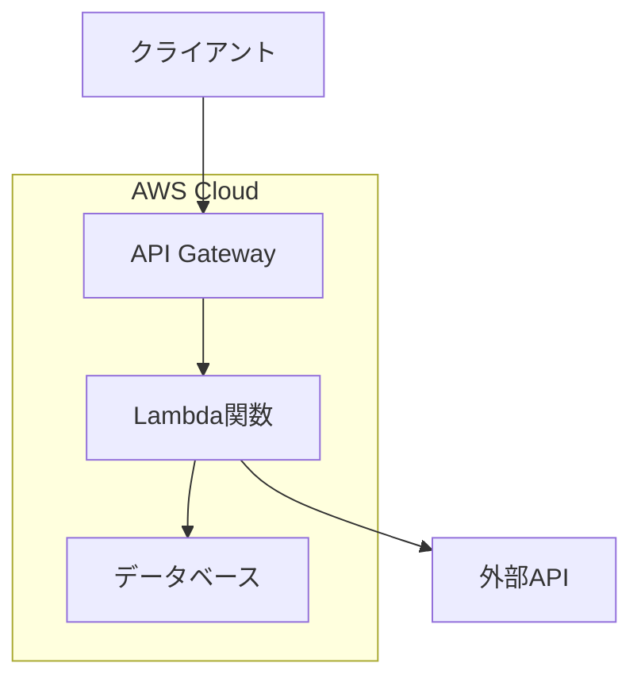
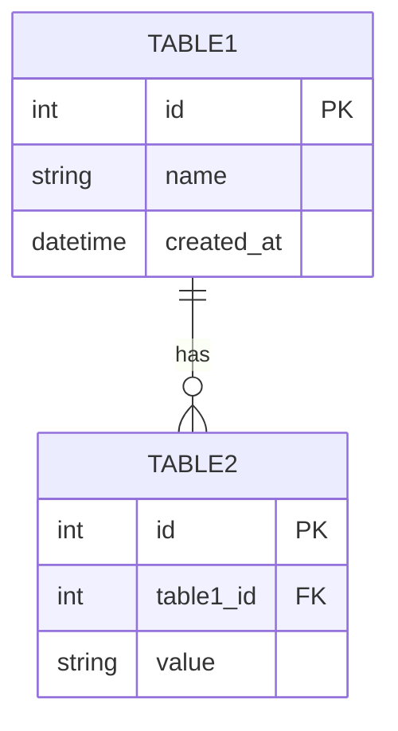
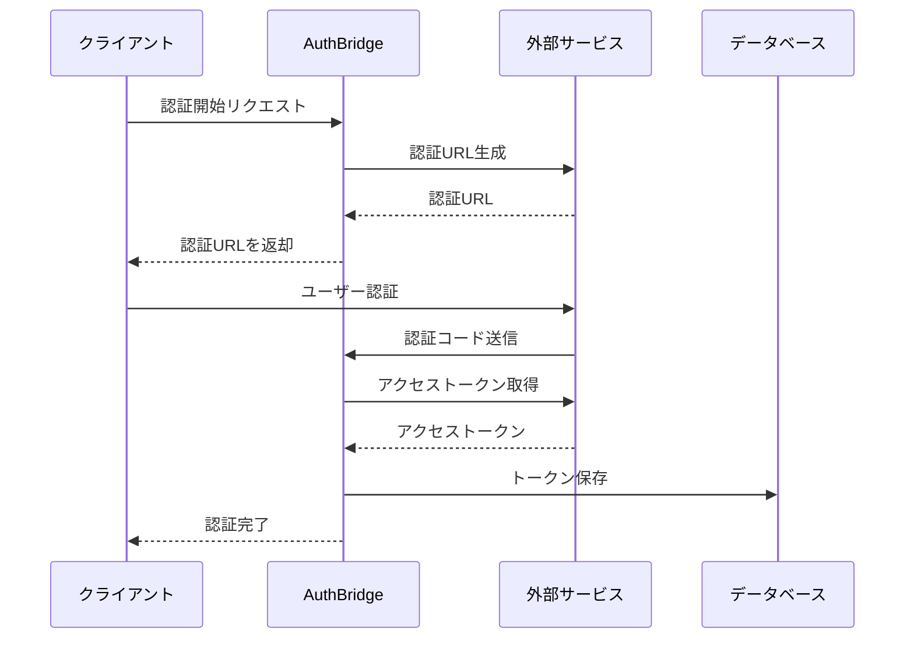
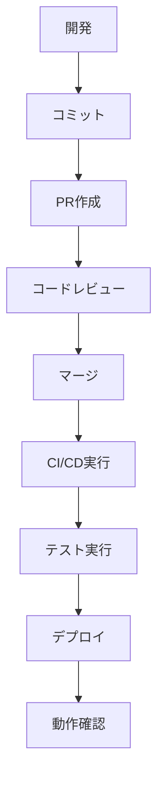

# [プロジェクト名] 内部仕様書

**文書バージョン**: v1.0  
**作成日**: [作成日]  
**最終更新**: [更新日]  
**作成者**: [作成者名]

---

## 📋 目次

1. [システム概要](#1-システム概要)
2. [アーキテクチャ設計](#2-アーキテクチャ設計)
3. [データベース設計](#3-データベース設計)
4. [API仕様](#4-api仕様)
5. [認証・認可](#5-認証認可)
6. [セキュリティ](#6-セキュリティ)
7. [監視・ログ](#7-監視ログ)
8. [デプロイメント](#8-デプロイメント)
9. [開発ガイドライン](#9-開発ガイドライン)
10. [運用手順](#10-運用手順)
11. [今後の改善計画](#11-今後の改善計画)

---

## 1. システム概要

### 1.1 プロジェクト目的
[プロジェクトの目的・背景を記載]

### 1.2 システム役割
[システムが担う役割・責務を記載]

### 1.3 技術スタック

| 分類 | 技術 | バージョン | 用途 |
|------|------|-----------|------|
| **フレームワーク** | [フレームワーク名] | [バージョン] | [用途説明] |
| **ランタイム** | [言語名] | [バージョン] | [用途説明] |
| **クラウド** | [クラウドサービス] | - | [用途説明] |
| **データベース** | [DB名] | [バージョン] | [用途説明] |
| **ストレージ** | [ストレージ名] | - | [用途説明] |
| **ユーティリティ** | [ライブラリ名] | [バージョン] | [用途説明] |

### 1.4 システム要件

#### 機能要件
- [機能要件1の説明]
- [機能要件2の説明]
- [機能要件3の説明]

#### 非機能要件
- **可用性**: [可用性要件]
- **パフォーマンス**: [パフォーマンス要件]
- **セキュリティ**: [セキュリティ要件]
- **拡張性**: [拡張性要件]

---

## 2. アーキテクチャ設計

### 2.1 システム全体図

```
[システム全体のアーキテクチャ図をテキストまたはMermaidで記載]
```

### 2.2 コンポーネント構成

#### 2.2.1 [コンポーネント名1]
- **役割**: [コンポーネントの役割]
- **技術**: [使用技術]
- **主要機能**:
  - [機能1]
  - [機能2]
  - [機能3]

#### 2.2.2 [コンポーネント名2]
- **役割**: [コンポーネントの役割]
- **技術**: [使用技術]
- **主要機能**:
  - [機能1]
  - [機能2]
  - [機能3]

### 2.3 データフロー



### 2.4 セキュリティ境界
- **パブリック層**: [パブリック層の説明]
- **アプリケーション層**: [アプリケーション層の説明]
- **データ層**: [データ層の説明]

---

## 3. データベース設計

### 3.1 データベース構成

| データベース | タイプ | 用途 | 接続方法 |
|-------------|-------|------|----------|
| [DB名1] | [タイプ] | [用途] | [接続方法] |
| [DB名2] | [タイプ] | [用途] | [接続方法] |

### 3.2 テーブル設計

#### 3.2.1 [テーブル名1]
**目的**: [テーブルの目的]

| カラム名 | データ型 | 制約 | 説明 |
|---------|---------|------|------|
| [カラム1] | [型] | [制約] | [説明] |
| [カラム2] | [型] | [制約] | [説明] |
| [カラム3] | [型] | [制約] | [説明] |

**インデックス**:
- PRIMARY KEY: `[カラム名]`
- INDEX: `[インデックス名]` ([カラム名])

#### 3.2.2 [テーブル名2]
**目的**: [テーブルの目的]

| カラム名 | データ型 | 制約 | 説明 |
|---------|---------|------|------|
| [カラム1] | [型] | [制約] | [説明] |
| [カラム2] | [型] | [制約] | [説明] |

### 3.3 ER図



---

## 4. API仕様

### 4.1 API設計原則
- [設計原則1]
- [設計原則2]
- [設計原則3]

### 4.2 エンドポイント一覧

#### 4.2.1 [機能グループ1]

| メソッド | エンドポイント | 説明 | 認証 |
|---------|---------------|------|------|
| GET | `/api/v1/[リソース]` | [説明] | [認証要否] |
| POST | `/api/v1/[リソース]` | [説明] | [認証要否] |
| PUT | `/api/v1/[リソース]/{id}` | [説明] | [認証要否] |
| DELETE | `/api/v1/[リソース]/{id}` | [説明] | [認証要否] |

#### 4.2.2 [機能グループ2]

| メソッド | エンドポイント | 説明 | 認証 |
|---------|---------------|------|------|
| GET | `/api/v1/[リソース2]` | [説明] | [認証要否] |
| POST | `/api/v1/[リソース2]` | [説明] | [認証要否] |

### 4.3 リクエスト・レスポンス例

#### GET /api/v1/[リソース]

**リクエスト**:
```json
{
  "parameter1": "value1",
  "parameter2": "value2"
}
```

**レスポンス**:
```json
{
  "status": "success",
  "data": {
    "id": 1,
    "name": "example",
    "created_at": "2024-01-01T00:00:00Z"
  }
}
```

### 4.4 エラーハンドリング

| ステータスコード | エラータイプ | 説明 |
|-----------------|-------------|------|
| 400 | Bad Request | [説明] |
| 401 | Unauthorized | [説明] |
| 403 | Forbidden | [説明] |
| 404 | Not Found | [説明] |
| 500 | Internal Server Error | [説明] |

---

## 5. 認証・認可

### 5.1 認証フロー

#### 5.1.1 [外部サービス1] 認証フロー



### 5.2 トークン管理
- **アクセストークン**: [管理方法の説明]
- **リフレッシュトークン**: [管理方法の説明]
- **トークン更新**: [更新ロジックの説明]

### 5.3 認可制御
- [認可制御の仕組み]
- [アクセス制御の方針]

---

## 6. セキュリティ

### 6.1 セキュリティ要件
- [セキュリティ要件1]
- [セキュリティ要件2]
- [セキュリティ要件3]

### 6.2 機密情報管理

| 情報タイプ | 保存場所 | 暗号化 | アクセス制御 |
|-----------|---------|-------|-------------|
| [情報1] | [保存場所] | [暗号化方式] | [アクセス制御] |
| [情報2] | [保存場所] | [暗号化方式] | [アクセス制御] |

### 6.3 ネットワークセキュリティ
- **VPC設定**: [VPC設定の説明]
- **セキュリティグループ**: [SG設定の説明]
- **通信暗号化**: [暗号化の説明]

### 6.4 IAMロール・ポリシー

#### [ロール名1]
- **目的**: [ロールの目的]
- **権限**: [付与される権限]
- **適用範囲**: [適用対象]

---

## 7. 監視・ログ

### 7.1 監視項目

| 項目 | 監視方法 | 閾値 | アラート |
|------|---------|------|--------|
| [監視項目1] | [監視方法] | [閾値] | [アラート設定] |
| [監視項目2] | [監視方法] | [閾値] | [アラート設定] |

### 7.2 ログ設計

#### ログレベル
- **ERROR**: [ERROR レベルの説明]
- **WARN**: [WARN レベルの説明]
- **INFO**: [INFO レベルの説明]
- **DEBUG**: [DEBUG レベルの説明]

#### ログ出力項目
```json
{
  "timestamp": "2024-01-01T00:00:00Z",
  "level": "INFO",
  "message": "処理完了",
  "request_id": "req-123456",
  "user_id": "user-789",
  "additional_data": {}
}
```

### 7.3 メトリクス
- **パフォーマンス**: [パフォーマンスメトリクス]
- **エラー率**: [エラー率の測定方法]
- **可用性**: [可用性の測定方法]

---

## 8. デプロイメント

### 8.1 環境構成

| 環境 | 用途 | URL | デプロイ方法 |
|------|------|-----|-------------|
| development | [用途] | [URL] | [デプロイ方法] |
| staging | [用途] | [URL] | [デプロイ方法] |
| production | [用途] | [URL] | [デプロイ方法] |

### 8.2 デプロイフロー



### 8.3 設定管理

#### 必須設定項目

| 設定項目 | 説明 | 設定場所 | 例 |
|---------|------|---------|-----|
| [設定1] | [説明] | [設定場所] | [例] |
| [設定2] | [説明] | [設定場所] | [例] |

#### 環境固有設定

**Development**:
- [開発環境固有の設定]

**Staging**:
- [ステージング環境固有の設定]

**Production**:
- [本番環境固有の設定]

### 8.4 ロールバック手順
1. [ロールバック手順1]
2. [ロールバック手順2]
3. [ロールバック手順3]

---

## 9. 開発ガイドライン

### 9.1 コーディング規約

#### Python
- [Python コーディング規約]
- [命名規則]
- [ドキュメント記述方法]

#### インフラ
- [インフラコード規約]
- [設定ファイル管理]

### 9.2 テスト戦略

#### テストレベル
- **単体テスト**: [単体テストの方針]
- **統合テスト**: [統合テストの方針]
- **E2Eテスト**: [E2Eテストの方針]

#### テストカバレッジ
- **目標カバレッジ**: [目標値]
- **測定方法**: [測定ツール・方法]

### 9.3 開発フロー

1. **要件定義**: [要件定義の進め方]
2. **設計**: [設計の進め方]
3. **実装**: [実装の進め方]
4. **テスト**: [テストの進め方]
5. **リリース**: [リリースの進め方]

### 9.4 ツール・環境

| ツール | 用途 | バージョン |
|-------|------|-----------|
| [ツール1] | [用途] | [バージョン] |
| [ツール2] | [用途] | [バージョン] |

---

## 10. 運用手順

> 詳細な運用手順・アラート対応・メンテナンスのRunbookは `TEMPLATE_OPERATION.md` を基に別途整備すること。本セクションにはバックエンド固有の補足や依存関係のみ記載してください。

### 10.1 日常運用

#### 定期作業
- [定期作業1の説明]
- [定期作業2の説明]

#### 監視作業
- [監視作業1の説明]
- [監視作業2の説明]

### 10.2 障害対応

#### 障害レベル
- **レベル1**: [レベル1の定義と対応]
- **レベル2**: [レベル2の定義と対応]
- **レベル3**: [レベル3の定義と対応]

#### エスカレーション
1. [エスカレーション手順1]
2. [エスカレーション手順2]
3. [エスカレーション手順3]

### 10.3 メンテナンス

#### 定期メンテナンス
- **頻度**: [メンテナンス頻度]
- **作業内容**: [作業内容]
- **ダウンタイム**: [ダウンタイム]

#### 緊急メンテナンス
- **判断基準**: [緊急メンテナンスの判断基準]
- **手順**: [緊急メンテナンス手順]

---

## 11. 今後の改善計画

### 11.1 短期改善項目（3ヶ月以内）
- [ ] [改善項目1]
- [ ] [改善項目2]
- [ ] [改善項目3]

### 11.2 中期改善項目（6ヶ月以内）
- [ ] [改善項目1]
- [ ] [改善項目2]
- [ ] [改善項目3]

### 11.3 長期改善項目（1年以内）
- [ ] [改善項目1]
- [ ] [改善項目2]
- [ ] [改善項目3]

### 11.4 技術的負債
- [技術的負債1の説明と対応計画]
- [技術的負債2の説明と対応計画]

---

## 付録

### A. 用語集

| 用語 | 説明 |
|------|------|
| [用語1] | [説明] |
| [用語2] | [説明] |

### B. 参考資料

- [参考資料1のタイトル](URL)
- [参考資料2のタイトル](URL)
- [参考資料3のタイトル](URL)

### C. 変更履歴

| バージョン | 日付 | 変更内容 | 作成者 |
|-----------|------|---------|--------|
| v1.0 | [日付] | [変更内容] | [作成者] |

---

## 📝 テンプレート使用ガイド

### 🎯 このテンプレートの使い方

1. **プロジェクト情報の置き換え**
   - `[プロジェクト名]` → 実際のプロジェクト名
   - `[作成日]` → 文書作成日
   - `[作成者名]` → 作成者名

2. **技術情報の記入**
   - 技術スタック表の各項目を実際の技術で置き換え
   - バージョン情報を最新のものに更新

3. **アーキテクチャ図の作成**
   - Mermaid記法でシステム構成図を作成
   - テキストベースでも可

4. **セクションのカスタマイズ**
   - プロジェクトに不要なセクションは削除
   - 必要に応じて独自セクションを追加

### 🔧 カスタマイズのポイント

- **システム規模に応じた調整**: 小規模なプロジェクトでは一部セクションを簡略化
- **技術スタックに応じた調整**: 使用技術に応じてセクション内容を調整
- **運用体制に応じた調整**: 運用体制に合わせて運用手順セクションを調整

### 📋 チェックリスト

- [ ] プロジェクト固有情報の記入完了
- [ ] 技術スタック情報の記入完了
- [ ] アーキテクチャ図の作成完了
- [ ] API仕様の記入完了
- [ ] セキュリティ要件の記入完了
- [ ] 運用セクションに `TEMPLATE_OPERATION.md` ベースのRunbook参照とバックエンド固有事項を記載
- [ ] 改善計画の記入完了
- [ ] 影響のあるADRを `docs/adr/` に作成または更新済み
- [ ] `template/Architecture.md` の更新が必要か確認し反映済み

## 📤 ファイル分割ガイド

- 本テンプレートが肥大化した場合は「UI」「アーキテクチャ」「リリース管理」などテーマ単位でファイルを分割し、`TEMPLATE_INTERNAL_SPECIFICATION_BACKEND_APP_part-01.md` のように通し番号を付けてください。
- 分割後は各ファイルに本ガイドを残し、最新の構成を `README` または索引用ファイルにまとめてください。
- 大型バージョンアップ時は旧版を `archive/` ディレクトリに移動し、差分を明記したチェンジログを作成してください。
