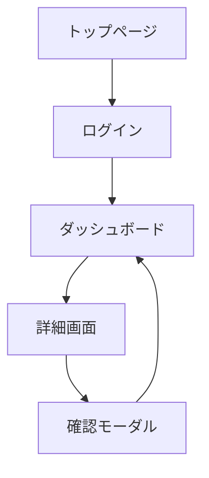
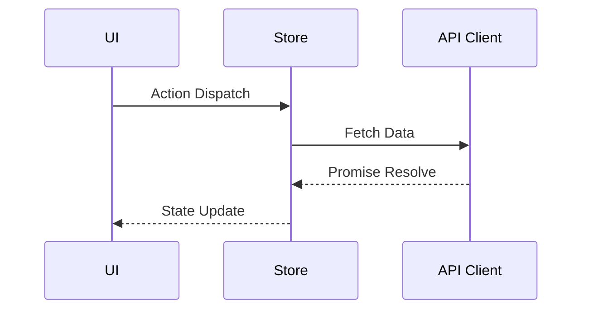
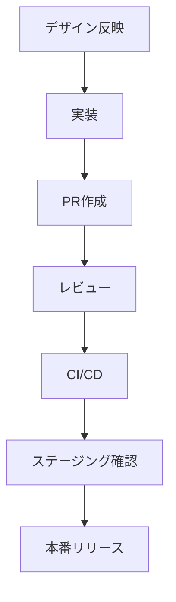

# [プロジェクト名] フロントエンド内部仕様書

**文書バージョン**: v1.0  
**作成日**: [作成日]  
**最終更新**: [更新日]  
**作成者**: [作成者名]

---

## 📋 目次

1. [システム概要](#1-システム概要)
2. [UI・UXガイドライン](#2-uiuxガイドライン)
3. [アーキテクチャ設計](#3-アーキテクチャ設計)
4. [状態管理とデータフロー](#4-状態管理とデータフロー)
5. [API・バックエンド連携](#5-apiバックエンド連携)
6. [認証・認可](#6-認証認可)
7. [パフォーマンス最適化](#7-パフォーマンス最適化)
8. [エラーハンドリングとロギング](#8-エラーハンドリングとロギング)
9. [テスト戦略](#9-テスト戦略)
10. [ビルド・デプロイメント](#10-ビルドデプロイメント)
11. [運用・サポート手順](#11-運用サポート手順)
12. [今後の改善計画](#12-今後の改善計画)

---

## 1. システム概要

### 1.1 プロジェクト目的
[プロジェクトの目的・背景を記載]

### 1.2 ターゲットユーザー
- [主要ユーザー1]
- [主要ユーザー2]

### 1.3 技術スタック

| 分類 | 技術 | バージョン | 用途 |
|------|------|-----------|------|
| **フレームワーク** | [React/Vue/Angularなど] | [バージョン] | [用途説明] |
| **言語** | [TypeScript/JavaScriptなど] | [バージョン] | [用途説明] |
| **ビルドツール** | [Vite/Webpackなど] | [バージョン] | [用途説明] |
| **UIライブラリ** | [Material UI/Tailwindなど] | [バージョン] | [用途説明] |
| **状態管理** | [Redux/Zustand/Recoilなど] | [バージョン] | [用途説明] |
| **ユーティリティ** | [日付/HTTPライブラリなど] | [バージョン] | [用途説明] |

### 1.4 システム要件

#### 機能要件
- [機能要件1の説明]
- [機能要件2の説明]
- [機能要件3の説明]

#### 非機能要件
- **パフォーマンス**: [例: SPA初回ロード3秒以内]
- **アクセシビリティ**: [例: WCAG 2.1 AA 準拠]
- **クロスブラウザ**: [サポートブラウザ]
- **保守性**: [コード規約や設計方針]

---

## 2. UI・UXガイドライン

### 2.1 デザイン原則
- [原則1]
- [原則2]

### 2.2 画面一覧

| 画面ID | 画面名 | 概要 | 備考 |
|--------|--------|------|------|
| [SCREEN-01] | [画面名] | [説明] | [備考] |

### 2.3 コンポーネント設計

| カテゴリ | コンポーネント | 役割 | 再利用可否 |
|----------|----------------|------|-------------|
| レイアウト | [Header] | [説明] | [可/不可] |
| UI要素 | [Button] | [説明] | [可/不可] |

### 2.4 ユーザーフロー



### 2.5 アクセシビリティ・国際化
- **アクセシビリティ**: [フォーカス管理、ARIAなど]
- **翻訳・ローカライズ**: [対応言語、翻訳方法]
- **レスポンシブ対応**: [ブレークポイントと方針]

---

## 3. アーキテクチャ設計

### 3.1 フロントエンド構造

```
[src]
 ├─ components
 ├─ features
 ├─ pages
 ├─ hooks
 ├─ store
 └─ utils
```

### 3.2 レイヤー構成
- **プレゼンテーション層**: [役割とルール]
- **ロジック層**: [役割とルール]
- **データアクセス層**: [APIクライアントなどの扱い]

### 3.3 依存関係と命名規則
- [ディレクトリ命名規則]
- [コンポーネント命名規則]
- [循環参照防止のガイドライン]

---

## 4. 状態管理とデータフロー

### 4.1 グローバル状態
- **ストア**: [使用ライブラリと責務]
- **ドメイン別スライス**: [例: ユーザー/通知]

### 4.2 ローカル状態とパフォーマンス
- [フォーム/モーダルなどの扱い]

### 4.3 データフロー図



### 4.4 キャッシング・データ保持
- **キャッシュ戦略**: [Stale-While-Revalidateなど]
- **永続化**: [localStorage/IndexedDBの利用方針]

---

## 5. API・バックエンド連携

### 5.1 API クライアント設計
- **HTTPライブラリ**: [axios/fetchなど]
- **共通設定**: [ベースURL、ヘッダー]

### 5.2 エンドポイント一覧

| 機能 | メソッド | エンドポイント | DTO | 備考 |
|------|----------|---------------|-----|------|
| [ユーザー取得] | GET | `/api/v1/users` | `UserResponse` | [備考] |

### 5.3 リクエスト/レスポンス型定義
- **Request DTO**: `UserRequest` = [定義場所]
- **Response DTO**: `UserResponse` = [定義場所]

### 5.4 API変更時の対応
- [フェイルセーフなリリース手順]
- [バージョニングポリシー]

---

## 6. 認証・認可

### 6.1 認証フロー
- [クライアント側のセッション管理方法]
- [トークン保管ポリシー (Cookie/Storage)]

### 6.2 認可
- **ルートガード**: [実装概要]
- **権限別UI制御**: [ロールとの紐づけ方法]

### 6.3 セッション有効期限
- **更新タイミング**: [手動/自動リフレッシュの方針]

---

## 7. パフォーマンス最適化

### 7.1 指標と目標値
- **Core Web Vitals**: [具体的な目標値]
- **バンドルサイズ**: [上限値]

### 7.2 最適化手法
- **コード分割**: [ルールと対象]
- **画像最適化**: [フォーマット/遅延読み込み]
- **メモ化戦略**: [useMemo/useCallbackの方針]

### 7.3 オフライン対応（必要な場合）
- [Service Worker利用方針]
- [キャッシュ戦略]

---

## 8. エラーハンドリングとロギング

### 8.1 エラー分類
- **UIエラー**: [ユーザー通知方法]
- **APIエラー**: [処理方針]
- **想定外エラー**: [フォールバックUI]

### 8.2 ログ収集
- **クライアントログ**: [収集ツールやサンプリング]
- **トラッキング**: [トラッキングイベント命名規則]

### 8.3 モニタリング
- [Sentry/Datadogなどの設定]
- [重要アラート基準]

---

## 9. テスト戦略

### 9.1 テストレベル
- **ユニットテスト**: [対象と基準]
- **コンポーネントテスト**: [使用ツール例: Testing Library]
- **E2Eテスト**: [ツール例: Playwright/Cypress]

### 9.2 テストカバレッジ
- **目標カバレッジ**: [％]
- **CI連携**: [レポート方法]

### 9.3 モック/スタブ
- [モックサーバー/Storybookの利用方針]

---

## 10. ビルド・デプロイメント

### 10.1 環境構成

| 環境 | 用途 | ホスティング | ビルドコマンド |
|------|------|--------------|----------------|
| development | [用途] | [ホスティング先] | `npm run dev` |
| staging | [用途] | [ホスティング先] | `npm run build` |
| production | [用途] | [ホスティング先] | `npm run build` |

### 10.2 デプロイフロー



### 10.3 設定管理
- **環境変数**: [一覧と格納方法]
- **Feature Flag**: [導入方針]

---

## 11. 運用・サポート手順

> フロントエンド全体に共通する日常運用やアラート対応は `TEMPLATE_OPERATION.md` を基に作成する運用ドキュメントへ集約し、本セクションではフロントエンド固有のタスクや依存関係のみを記載してください。

### 11.1 日常運用
- **コンテンツ更新**: [担当と手順]
- **依存ライブラリアップデート**: [頻度と手順]

### 11.2 障害対応
- **優先度定義**: [対応 SLA]
- **ロールバック**: [ビルドのバックアップ方法]

### 11.3 ユーザーサポート
- [サポートチャネル]
- [問い合わせハンドリングフロー]

---

## 12. 今後の改善計画

### 12.1 短期改善項目（3ヶ月以内）
- [ ] [改善項目1]
- [ ] [改善項目2]

### 12.2 中期改善項目（6ヶ月以内）
- [ ] [改善項目1]
- [ ] [改善項目2]

### 12.3 長期改善項目（1年以内）
- [ ] [改善項目1]
- [ ] [改善項目2]

### 12.4 技術的負債
- [技術的負債1の説明と対応計画]
- [技術的負債2の説明と対応計画]

---

## 付録

### A. 用語集

| 用語 | 説明 |
|------|------|
| [用語1] | [説明] |
| [用語2] | [説明] |

### B. 参考資料

- [参考資料1のタイトル](URL)
- [参考資料2のタイトル](URL)

### C. 変更履歴

| バージョン | 日付 | 変更内容 | 作成者 |
|-----------|------|---------|--------|
| v1.0 | [日付] | [初版作成] | [作成者] |

---

### 📋 チェックリスト

- [ ] プロジェクト固有情報の記入完了
- [ ] UI/UX設計情報の記入完了
- [ ] 状態管理・データフローの記入完了
- [ ] API連携仕様の記入完了
- [ ] テスト方針の記入完了
- [ ] 運用セクションに `TEMPLATE_OPERATION.md` への参照とフロント固有事項を記載
- [ ] 影響のあるADRを `docs/adr/` に作成または更新済み
- [ ] `template/Architecture.md` の更新が必要か確認し反映済み

---

## 📤 ファイル分割ガイド

- 本テンプレートが1ファイルで扱いづらくなった場合、機能領域ごとに分割し、`TEMPLATE_INTERNAL_SPECIFICATION_FRONTEND_part-01.md` のように連番を付与してください。
- 分割後は目次を更新し、各ファイルの末尾にも同様のガイドを追記して分割方針を維持してください。
- 大型アップデート時は「UI・UX」「状態管理」「デプロイメント」などテーマ単位での再編成を検討してください。
