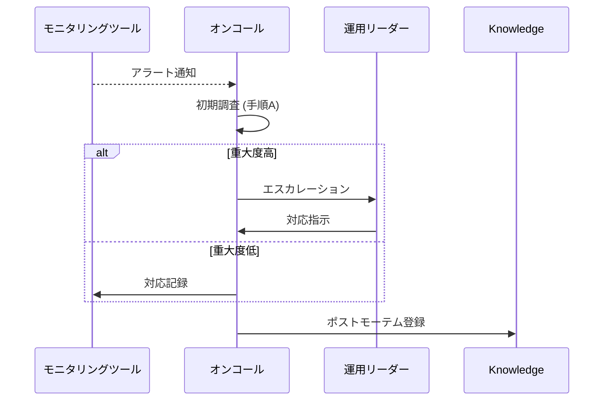

# [プロジェクト名] 運用手順テンプレート

**文書バージョン**: v1.0  
**作成日**: [作成日]  
**最終更新**: [更新日]  
**作成者**: [作成者名]

---

## 📋 目次

1. [運用概要](#1-運用概要)
2. [組織と責務](#2-組織と責務)
3. [環境構成と権限管理](#3-環境構成と権限管理)
4. [日常運用手順](#4-日常運用手順)
5. [監視・アラート運用](#5-監視アラート運用)
6. [インシデント対応](#6-インシデント対応)
7. [定期メンテナンス](#7-定期メンテナンス)
8. [変更管理とリリース](#8-変更管理とリリース)
9. [バックアップとリストア](#9-バックアップとリストア)
10. [セキュリティ運用](#10-セキュリティ運用)
11. [ナレッジ・コミュニケーション](#11-ナレッジコミュニケーション)
12. [改善計画とレビュー](#12-改善計画とレビュー)
13. [付録](#13-付録)

---

## 1. 運用概要

### 1.1 背景と目的
- [運用体制導入の背景]
- [本ドキュメントの目的]

### 1.2 運用範囲
- **対象システム**: [対象サービス名]
- **対象外**: [外部サービス等]
- **稼働時間帯**: [例: 24/7, 平日 9:00-18:00]

### 1.3 SLA/SLO
- **サービスレベル目標**: [可用性/応答時間など]
- **測定方法**: [メトリクス、ツール]

---

## 2. 組織と責務

### 2.1 運用チーム体制

| 役割 | 担当者 | 責務 | 連絡先 |
|------|--------|------|--------|
| 運用リーダー | [氏名] | [責務] | [連絡先] |
| オンコール担当 | [氏名] | [責務] | [連絡先] |

### 2.2 連絡体制
- **エスカレーション順**: [手順]
- **連絡チャネル**: [Slack/Teams/電話]
- **稼働スケジュール**: [当番表へのリンク]

---

## 3. 環境構成と権限管理

### 3.1 環境一覧

| 環境 | URL / エンドポイント | 主用途 | 管理責任者 |
|------|--------------------|--------|------------|
| Development | [URL] | [用途] | [担当] |
| Staging | [URL] | [用途] | [担当] |
| Production | [URL] | [用途] | [担当] |

### 3.2 権限・アクセス
- **認可方針**: [RBAC/ABACなど]
- **アカウント管理手順**: [作成/削除フロー]
- **監査ログ確認方法**: [ツール・場所]

---

## 4. 日常運用手順

### 4.1 定期点検タスク

| 頻度 | タスク | 手順 | 所要時間 | 実施者 |
|------|--------|------|----------|--------|
| 毎日 | [タスク名] | [手順概要] | [時間] | [担当] |

### 4.2 業務オペレーション
- **データ処理**: [ETL/バッチなどの手順]
- **レポート生成**: [担当・提出先]
- **手動作業の自動化計画**: [対象とロードマップ]

---

## 5. 監視・アラート運用

### 5.1 監視対象

| カテゴリ | 指標 | 閾値 | ツール | 備考 |
|----------|------|------|--------|------|
| インフラ | [CPU使用率] | [80%] | [CloudWatchなど] | [備考] |

### 5.2 アラート対応フロー

### 5.3 アラートチューニング
- **閾値見直しタイミング**: [例: 月次レビュー]
- **ノイズ低減策**: [緩和方法]

---

## 6. インシデント対応

### 6.1 定義と優先度

| レベル | 影響範囲 | 対応目標時間 | 報告対象 |
|--------|----------|--------------|----------|
| P1 | [全サービス停止] | [15分以内] | [経営層] |

### 6.2 対応手順
1. [検知]
2. [一次切り分け]
3. [エスカレーション]
4. [復旧対応]
5. [ポストモーテム]

### 6.3 ポストモーテム
- **実施タイミング**: [例: 発生後48時間以内]
- **フォーマット**: [テンプレートへのリンク]
- **アクション管理**: [JIRA/Backlogなど]

---

## 7. 定期メンテナンス

### 7.1 メンテナンス計画
- **年間スケジュール**: [日程表へのリンク]
- **対象システム**: [範囲]

### 7.2 手順

| 作業 | 事前準備 | 実施手順 | 検証 | ロールバック |
|------|----------|----------|------|--------------|
| [作業名] | [準備内容] | [ステップ] | [確認方法] | [手順] |

### 7.3 通知と承認
- **通知チャネル**: [ユーザー・関係者]
- **承認フロー**: [管理者→運用リーダー→ステークホルダー]

---

## 8. 変更管理とリリース

### 8.1 変更分類
- **標準変更**: [定義と例]
- **緊急変更**: [定義と例]
- **特別変更**: [承認フロー]

### 8.2 リリース前チェック
- **チェックリスト**: [テスト完了、バックアップ取得など]
- **Go/No-Go判定**: [責任者]

### 8.3 リリース後対応
- **サモナーログ**: [記録方法]
- **リリースレビュー**: [フィードバック収集]

---

## 9. バックアップとリストア

### 9.1 バックアップ戦略
- **対象データ**: [DB/ストレージ/S3など]
- **保持期間**: [期間]
- **保存先**: [リージョン/媒体]

### 9.2 リストア手順
1. [準備]
2. [リストア実行コマンド/手順]
3. [検証項目]
4. [コミュニケーション]

### 9.3 DR（災害復旧）計画
- **RTO/RPO**: [指標値]
- **代替拠点**: [情報]
- **年次訓練**: [実施内容]

---

## 10. セキュリティ運用

### 10.1 脆弱性対応
- **スキャン頻度**: [ツールとスケジュール]
- **パッチ適用手順**: [手順]

### 10.2 ログ監査
- **対象ログ**: [アクセス/認証/システム]
- **保管期間**: [期間]
- **レビュー頻度**: [例: 月次]

### 10.3 インシデント対応チームとの連携
- **連絡先**: [CSIRT/PSIRT情報]
- **緊急時プロトコル**: [具体的手順]

---

## 11. ナレッジ・コミュニケーション

### 11.1 ドキュメント管理
- **保管場所**: [Confluence/Gitなど]
- **版管理**: [ルール]

### 11.2 定例ミーティング
- **頻度**: [ウィークリー/月次]
- **アジェンダ例**: [アラートレビュー、改善提案]

### 11.3 トレーニング
- **オンボーディング**: [手順と期間]
- **継続教育**: [研修内容]

---

## 12. 改善計画とレビュー

### 12.1 KPIレビュー
- **指標例**: [平均復旧時間、アラート誤検知率]
- **レビューサイクル**: [月次/四半期]

### 12.2 改善タスク一覧

| 優先度 | 項目 | 担当 | 期限 | 状況 |
|--------|------|------|------|------|
| High | [改善項目] | [担当] | [期限] | [ステータス] |

### 12.3 振り返り (Retro)
- **開催頻度**: [月次/四半期]
- **フォーマット**: [KPTなど]

---

## 13. 付録

### A. 用語集

| 用語 | 説明 |
|------|------|
| [用語1] | [説明] |

### B. 参照資料
- [資料名](URL)
- [外部Runbook](URL)

### C. 変更履歴

| バージョン | 日付 | 変更内容 | 作成者 |
|-----------|------|---------|--------|
| v1.0 | [日付] | [初版作成] | [作成者] |

---

### 📋 チェックリスト

- [ ] 運用範囲・SLAの記入完了
- [ ] 体制と連絡先の記入完了
- [ ] 日常運用タスク表の記入完了
- [ ] 監視・アラート対応手順の記入完了
- [ ] インシデント/変更管理手順の記入完了
- [ ] バックアップ/リストア手順の記入完了
- [ ] ADR・Architectureを確認し整合性をチェック
- [ ] 関連Runbookや外部リソースのリンクを更新

---

## 📤 ファイル分割ガイド

- 本テンプレートが大きくなった場合は「日常運用」「インシデント対応」「セキュリティ運用」などテーマ別に分割し、`TEMPLATE_OPERATION_part-01.md` のように連番を付けてください。
- 分割後は索引用の `operation_index.md` を作成し、各パートの担当領域と更新履歴を整理してください。
- 過去版は `archive/operation/` 配下に保管し、主要な変更点を `CHANGELOG_operation.md` に記録してください。
